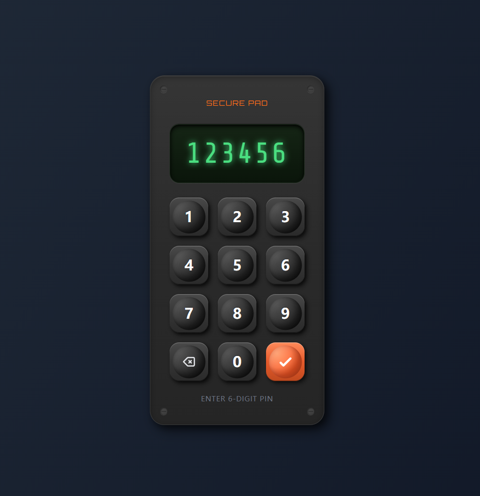

# 拟物化数字键盘

拟物风格数字密码输入器，模拟真实物理按键的触感和光影。

## 特点

- **球面凹陷** - 按键中心采用径向渐变，呈现立体球形凹陷效果
- **月相光影** - 光源从左上照射，阴影和高光形成弧形过渡
- **键盘同步** - 支持物理键盘操作，虚拟按键实时响应
- **状态反馈** - 输入完成显示绿色 PASS，未完成显示红色 FAILED

## 操作

- 数字键 `0-9` 输入密码
- `Backspace` 删除
- `Enter` 确认

## 技术

HTML + Tailwind CSS + 原生 JavaScript
